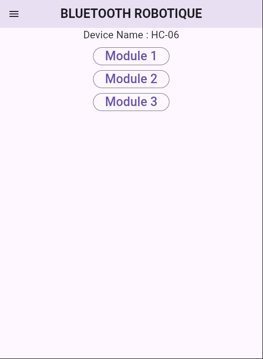

# bt_command

A new Flutter project.

## This is a simple flutter bluetooth command app

For build this project : `flutter pub get && flutter run`

For contribut , clone this project : `git clone https://github.com/Ferdinaelectro1/Bluetooth_command.git`

### Screenshoot for this apk

## Getting Started

This project is a starting point for a Flutter application.

A few resources to get you started if this is your first Flutter project:

- [Lab: Write your first Flutter app](https://docs.flutter.dev/get-started/codelab)
- [Cookbook: Useful Flutter samples](https://docs.flutter.dev/cookbook)

For help getting started with Flutter development, view the
[online documentation](https://docs.flutter.dev/), which offers tutorials,
samples, guidance on mobile development, and a full API reference.
